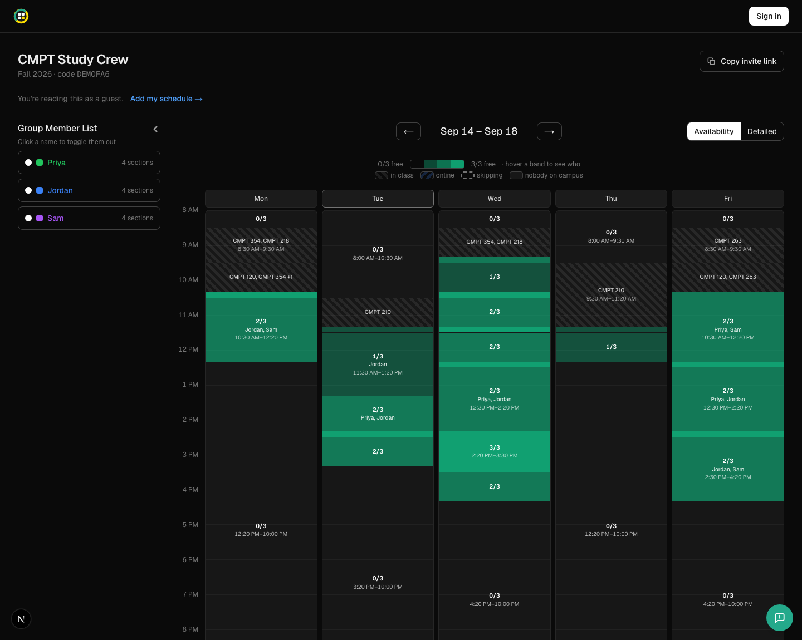
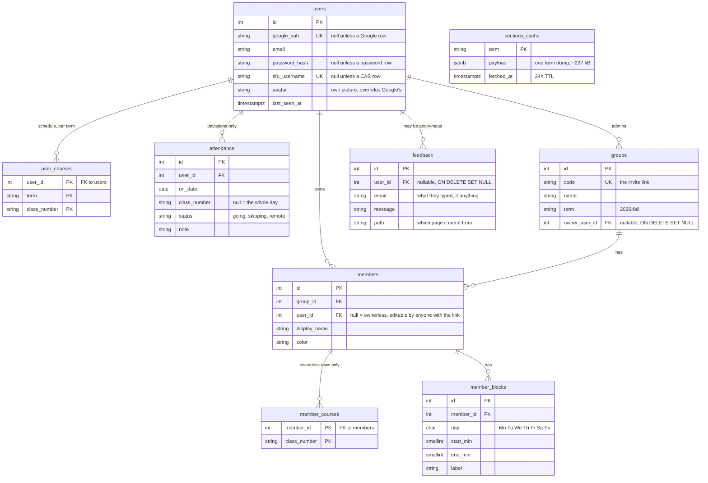

# meet.sfucourses.com



Everyone in a group drops their SFU schedule in; the grid shows when you're all
free on campus at the same time.

## How it works

Course data comes from the public [sfucourses API](https://api.sfucourses.com)
(`/v1/rest/sections?term=2026-fall`) — no key, open CORS. This repo does not
fork sfucourses.com, it only consumes that endpoint.

Sections are added in-app at `/courses`. Tutorials and labs are their own class
numbers, so each is added separately. Only class numbers are stored; meeting
times are resolved against the API at read time, so an upstream schedule change
is picked up without a migration.

### Finding the overlap

1. Expand each member's sections into busy intervals per weekday, dropping any
   section whose date range doesn't cover the displayed week.
2. Merge each member's overlapping intervals.
3. Complement within the search window (default 08:00–22:00) to get free time.
4. Intersect across members; keep windows at least `minMinutes` long.
5. Tag each window with the campus each member's nearest adjacent class is on.
   Different campuses means they can't actually meet — those render amber.

Members with no schedule yet are excluded, otherwise they'd read as "free
always" and silently widen everyone's overlap.

### Who's actually going

Where you're enrolled is not where you'll be. Any class on any date can be
marked **skipping** or **online**, from the block or from the day's heading:

- Skipping drops the class out of step 1, so the hour stops being busy and a
  real window opens. The block stays on the grid, hollow and dashed, because
  seeing *why* a window opened is the point.
- Online stops anchoring you to a campus. If it's your only class that day you
  drop out of availability entirely; if you also have in-person classes the
  hour stays busy, so it isn't offered as a meetup slot. The heat map draws it
  with a blue hatch.

Statuses are stored against the user and a date, not against a group, so
marking Thursday's lecture skipped shows in every group you're in. Only
deviations are stored — no row means you're going — and a status expires on its
own once the date has passed.

## Schema

Everything lives in the `meetup` Postgres schema so it can share a database
with another app without collisions.



Three things the diagram can't draw:

- `class_number` has no foreign key anywhere. Sections live in
  `sections_cache`, which is one JSON blob per term with a 24h TTL, so every
  member of every group shares a single upstream fetch.
- Schedules belong to the person, not the group: join a second group in the
  same term and your classes are already there. Terms are kept apart because a
  class number is only unique inside one, and a flat list would resolve a fall
  section against the spring catalogue and draw a different course.
- `meetup.member_courses_effective` is a view over both course tables. Owned
  member rows read `user_courses` for the group's term; ownerless rows —
  the ones predating sign-in — keep reading `member_courses`. The view is the
  one place that decides which.

## Setup

```bash
npm install
cp .env.example .env.local   # fill in DATABASE_URL
npm run migrate              # creates the `meetup` schema; safe to re-run
npm run dev
```

### Sign-in

Three doors, each its own credential column on `meetup.users`, never merged
with each other on a shared email address (see `db/migrations/007_password_auth.sql`
for why merging silently is the wrong shape):

- **Google.** Create a Web application OAuth client with a
  `<origin>/api/auth/callback/google` redirect URI per origin you use, then run
  `./scripts/set-google-oauth.sh` to write the credentials to `.env.local` and
  all three Vercel environments without them appearing on screen.
- **Email and password.** No mail infrastructure here, so the address is a
  label rather than a verified identity.
- **SFU CAS**, the only door that proves the person is at SFU. Off unless
  `SFU_CAS_ENABLED=1`. The password is typed at `cas.sfu.ca` and never reaches
  this site; what comes back is a one-time ticket validated server to server.
  Rosters show a boxed SFU verification badge next to members who came in this
  way, and only that boolean crosses the wire.

`SFU_CAS_BASE` is ignored in production unless it is https, because whoever
answers `/serviceValidate` decides who you are signed in as. The service URL is
built from `AUTH_URL` (set it to `https://meet.sfucourses.com` in Vercel) rather
than a request header, for the same reason. To walk the flow locally:

```bash
node scripts/fake-cas.mjs    # stands in for cas.sfu.ca, on :8099
SFU_CAS_ENABLED=1 SFU_CAS_BASE=http://localhost:8099/cas npm run dev
```

Sign-in is required to join a group, edit a schedule, or set a status; anyone
with the invite link can still view one. Ownerless member rows stay editable by
anyone with the link, and a signed-in user can claim one to take it over along
with its saved schedule.

### Admin portal

`/admin` shows every group, every user, and what's in the database. The session
id on the JWT is resolved to a `meetup.users` row and that row's email must be
on `ADMIN_EMAILS`, which is only ever written from Google's verified profile.
Anyone else gets a 404, so the portal doesn't confirm it exists.
`ADMIN_EMAILS` has no default: this repository is public, and a baked-in
address would become the allowlist of every clone. `ADMIN_GOOGLE_SUB` pins
access to one Google account instead of an address.

## Scripts

| command | does |
|---|---|
| `npm run migrate` | applies `db/migrations/*.sql` in order (idempotent) |
| `npm run inspect` | prints row counts and term-cache status |
| `node scripts/reset-demo.mjs` | deletes smoke-test groups |
| `./scripts/set-google-oauth.sh` | writes Google OAuth credentials locally and to Vercel |

## Tests

Vitest, in `tests/`, split by what each suite needs rather than by what it
covers — so the default one needs nothing at all.

| command | does | needs |
|---|---|---|
| `npm test` | interval maths, the heat map, attendance, the sfucourses parsers | nothing |
| `npm run test:watch` | the same, in watch mode | nothing |
| `npm run test:smoke` | checks the live API still has the shape `lib/sfu.ts` expects | the network |
| `npm run test:db` | group, membership and attendance SQL on a throwaway Neon branch | `NEON_API_KEY` |
| `npm run test:all` | all three | both |
| `npm run test:fixture` | regenerates `tests/fixtures/term-sample.json` | the network |

`npm test` is offline and deterministic: the parsers run against a committed
slice of a real term dump, so the awkward shapes SFU actually publishes —
sections with no campus, sections with no meeting days — stay covered without a
network call. `npm run test:db` creates its own branch, migrates it, and
deletes it afterwards; it never touches the `DATABASE_URL` in `.env.local`, and
it skips with a message when `NEON_API_KEY` is unset.

The rule that online is not on campus — a lecture attended from home is busy
time but puts nobody in a building — is pinned in `tests/unit/on-campus.test.ts`
and again in `tests/db/attendance.test.ts`. Reverting any one of `onCampus`,
`busyForMeetup` or `anchorCampus` in `lib/overlap.ts` turns that suite red.

### A note on `package-lock.json`

Regenerate it on Linux, not on a Mac:

```
docker run --rm -v "$PWD":/w -w /w node:22-bookworm npm install --package-lock-only
```

`sharp` and `@tailwindcss/oxide` ship wasm builds whose own dependencies npm
prunes from the lockfile when it resolves on macOS. The result installs fine
there and then fails `npm ci` on every Linux runner with two `@emnapi` packages
"missing from lock file".

## Scope

A group is a secret invite code — anyone with the link can view it. Sign-in
adds ownership: your schedule and name are yours to edit, and your identity
follows you across devices instead of living in `localStorage`.

**Courses** in the navigation is where your own week lives: the sections you're
in, and the grid they add up to, on one page, drawn from `meetup.user_courses`
with nobody else's column beside yours. **Calendar** goes back to the group
calendar you last had open — remembered per browser in `localStorage`, so it
survives a trip through Courses or Profile — and the pills above a group's grid
switch between the groups you're in.

Not built yet: custom busy blocks (`meetup.member_blocks` exists and is read,
but there's no UI to add them), calendar export, meeting-spot suggestions.
